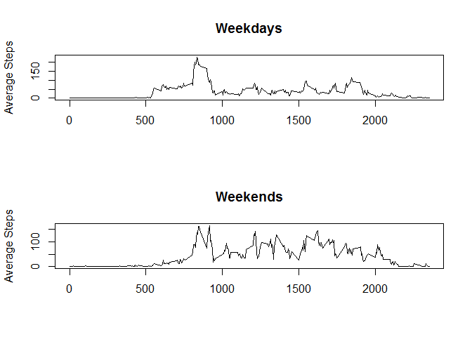

---
output:
  html_document: 
    keep_md: yes
  pdf_document: default
---
# Reproducible Research - Peer Assessment 1


## Loading and preprocessing the data

```r
df <- read.csv("./data/activity.csv")
df$date = as.Date(df$date)
dfNA <- df
df <- subset(df, !is.na(df$steps))
df <- arrange(df, date, interval)
return(head(df, 10))
```

```
##    steps       date interval
## 1      0 2012-10-02        0
## 2      0 2012-10-02        5
## 3      0 2012-10-02       10
## 4      0 2012-10-02       15
## 5      0 2012-10-02       20
## 6      0 2012-10-02       25
## 7      0 2012-10-02       30
## 8      0 2012-10-02       35
## 9      0 2012-10-02       40
## 10     0 2012-10-02       45
```


## What is mean total number of steps taken per day?

```r
steps_by_day <- tapply(df$steps, df$date, sum)
hist(steps_by_day, breaks = 30, main = "Total Steps Per Day")
```

<!-- -->

```r
mean_total_steps <- as.integer(mean(steps_by_day))
median_total_steps <- as.integer(median(steps_by_day))
```
Mean total steps taken per day: 10766  
Median total steps taken per day: 10765  


## What is the average daily activity pattern?

```r
steps_by_interval <- tapply(df$steps, df$interval, mean)
plot(unique(df$interval), steps_by_interval, xlab = "Interval", ylab = "Average Steps", main = "Average Steps Per Interval", type = "l")
```

<!-- -->

```r
max_mean <- as.integer(steps_by_interval[steps_by_interval == max(steps_by_interval)])
```
The interval with the highest mean steps across days is: 206


## Imputing missing values

```r
# create a new data frame where NA values are replaced with the average from that interval
df2 <- dfNA
for (i in seq_along(df2$steps)) {
    if (is.na(df2$steps[i])) {
        df2$steps[i] = steps_by_interval[[as.character(df2$interval[i])]]
    }
}
imputed_steps_by_day <- tapply(df2$steps, df2$date, sum)
hist(imputed_steps_by_day, breaks = 30, xlab = "Total Steps", main = "Total Steps Per Day (Imputed)")
```

<!-- -->

```r
count_NAs <- nrow(dfNA) - nrow(df)
mean_imputed_total_steps <- as.integer(mean(imputed_steps_by_day))
median_imputed_total_steps <- as.integer(median(imputed_steps_by_day))
```
Count of NA values: 2304  
Mean total steps taken per day (with imputed values): 10766  
Median total steps taken per day (with imputed values): 10766  


## Are there differences in activity patterns between weekdays and weekends?

```r
df2$weekday = "weekday"
weekends = ((weekdays(df2$date) == "Saturday") | (weekdays(df2$date) == "Sunday"))
df2[weekends, "weekday"] = "weekend"
df2$weekday = as.factor(df2$weekday)
wday_split <- split(df2, df2$weekday)
steps_on_weekdays <- tapply(wday_split$weekday[["steps"]], wday_split$weekday[["interval"]], mean)
steps_on_weekends <- tapply(wday_split$weekend[["steps"]], wday_split$weekend[["interval"]], mean)
par(mfcol = c(2, 1))
# add subtitle
plot(unique(df$interval), steps_on_weekdays, xlab = "", ylab = "Average Steps", main = "Weekdays", type = "l")
plot(unique(df$interval), steps_on_weekends, xlab = "", ylab = "Average Steps", main = "Weekends", type = "l")
```

<!-- -->
